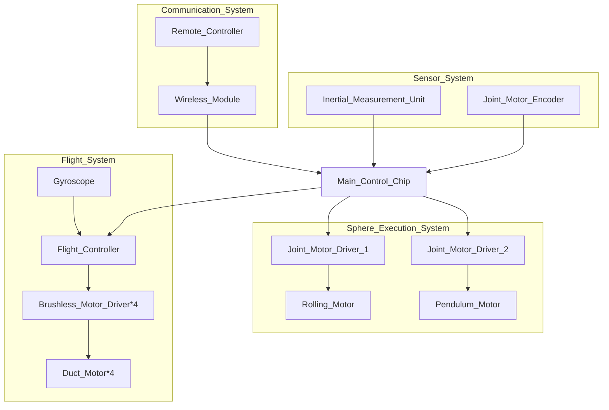
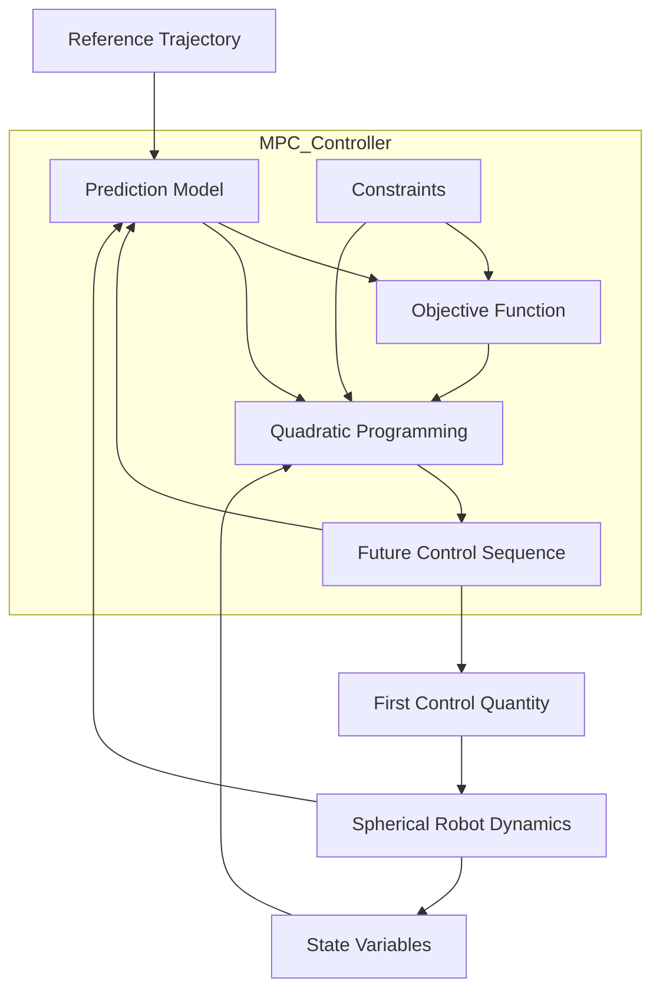

- **Main Contributions**:
  
  *Core member of spherical robot software (non-flight part)*
  
  1. Building a control system framework

                                        Figure 2. Control system flow chart

 The system is composed of four parts, with the following functions:

1. **Communication System**: It consists of a remote controller and a wireless module. This system transmits relevant instructions to the main control chip, enabling the remote - control function of the robot.
2. **Sensor System**: Comprising an IMU and a joint motor encoder. It measures the object's acceleration, angular velocity and other velocity - related data, and detects the position and speed of the joint motor. This provides real - time status information of the robot to the main control chip. 
3. **Sphere Execution System**: Has two joint motors. These motors are used to drive the robot for rolling and swinging respectively.
4. **Flight Control System**: The Pixhawk 6C Mini is directly used for configuration. Through the flight control, it controls four ducted motors to achieve the flight control of the robot.

  

        2.Implement a rolling control algorithm

                                 Figure 3.Model prediction algorithm flow chart

 1.**Algorithm Architecture Selection**: Chose the MPC algorithm architecture for the design.

 2.**Model Processing**: Referred to relevant papers to simplify the dynamics and kinematics model of the sphere.

 3.**Prediction and Index Establishment**: Utilized the method from the papers to combine the reference trajectory with the actual situation, established the performance index, and converted it into a quadratic optimization problem.

 4.**Algorithm Optimization**: Employed rolling programming to evaluate the effect within the limited time domain, and continuously adjusted the control step size, prediction step size, and weight matrix to optimize the algorithm.
