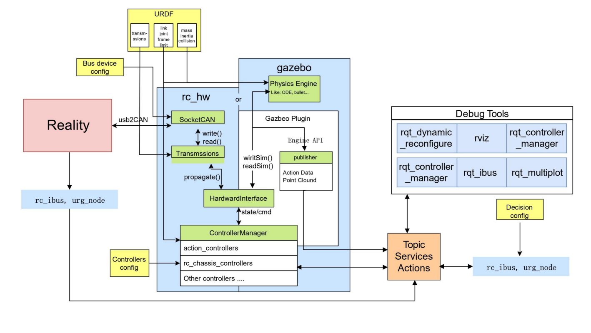

You can [click here](https://www.bilibili.com/video/BV1um4y1p7Fr/?spm_id_from=333.1387.0.0&vd_source=809a8e4a3a25a8809f443b4da653e707) to watch the wonderful moments of our competition.
# Second half semester of senior

## Robocon : R2 robot decision - position & navigation algo construction

- **Project Background**:
  
  In the second semester of my junior year, I participated in the Robocon. The theme of this year's competition is particle return to the warehouse. This stage mainly participates in the algorithm deployment and development of the positioning and navigation of the R2 automatic robot. This robot is responsible for the following tasks in the competition: First,Navigate to the storage area. Second, Place balls (grains) of different colors in designated boxes according to certain logic Third,Automatically decide the winning strategy to help the team score points.
  
  
  
                              Figure 1. Physical picture of R2 automatic robot

- **Main Contributions**:
  
  *R2 Control Manager*
  
  1. Robot Automatic Positioning


                                       Figure 2.Positioning algorithm architecture diagram

- B1(Dynamic Feature Filtering)

- B2(Point Cloud Registration)

- D1(IMU Pose Calculation)

In terms of robot positioning, we selected the mid360 radar to locate the robot by the fastlio2 algorithm. Fastlio2 filters dynamic feature points and processes the offset of the historical point cloud and the current point cloud to locate the robot. In actual use, the mid360 point cloud scanning frequency is only 10Hz, which is far from meeting the requirements of the competition. Therefore, we inserted 4 frames of imu positioning between the two frames of mid360 data. The imu positioning can be obtained by secondary integration, thus increasing the topic publication frequency to 50Hz.

2. Robot Path Algorithm Development
   
   In terms of planner: We encapsulate the most basic path planning algorithm into a class in the host computer. The encapsulation scheme is a base_local planner with reference to ROS. The interface is consistent with it, which can easily access open-source curve planning, but our planner does not join local paths and load them into plug-ins. This R2 path planning is a path planning call directly in the application layer of the APP. A smooth path can be generated given the target point and the midpoint of the path. Finally, a PD tracker is used to track the path points.
   
     
   
                           Figure 3.Limiting the robot's real-time path in rviz
   
   In terms of parameter management and debugging, PID parameters and path parameters are managed with yaml files. Combined with the visual interface that comes with ROS itself, we can display the curves generated after planning. Using rqt's series of tools, you can view the trajectory of the robot when it is moving and how well the curve we define fits, and you can also adjust the parameters of the PD tracker in real time.

# First half semester of senior

## Robocon,Control architecture design for the R1 robot

- **Project Background**:
  
  This project is a national college student robot competition for 2024Robocon. The theme is pellet return to the warehouse. I was responsible for the control part of the R1 robot in the first semester of my junior year. I was responsible for the STM32 configuration of the robot, path planning and the writing of the fine-state machine (FSM) globally. The task of this robot is to place the competition supplies (seedlings) in the transplanting area and project the harvested barn (pellets) to the receiving area. Thus completing the flow of the entire robot. Achieve the score of the competition.
  
  
  
                                         Figure 4.Overall picture of R1 robot

- **Main Contributions**:
  
  *Control Manager*
  
  1. Optimization of motor control modules
     
     
                                         Figure 5.Motor Mode Code Block
     
     In the motor control, I was responsible for optimizing the position mode, return to zero mode, setting mode and angle integration of the DJI series motors.
     
     - **Position Mode**
       
       In the position mode, we only calculate for a single turn. We make a double PID algorithm architecture, with the inner layer being the current ring and the outer layer being the position ring. This algorithm is used for precise position control of the 6020 absolute encoder


                        Figure 6.Motor position mode algorithm architecture diagram

- **Return To Zero Mode**
  
  In the algorithm within the HOVER_MODE:
  
  1. **Current Handling**: Check and limit motor current if it exceeds the threshold.
  
  2. **Position Mode Check**: When in position mode and the target position is reached, set a completion flag to trigger mode switching.
     
     1. **Speed Control**: Execute speed-loop PID calculation to regulate the motor’s rotational speed.

    
```c        
  // 速度环输出限幅
  float cali_out = constrain(cali_out, -1.5 * canstactorRealInfo[1].TORQUE, 1.5 * canstactorRealInfo[1].TORQUE);
  cali_out = constrain(cali_out, canstactorRealInfo[1].MOTOR_MAXCURRENT * MOTOR_CURRENT_TO_TORQUE + canstactorRealInfo[1].LOAD_TORQUE, canstactorRealInfo[1].MOTOR_MAXCURRENT * MOTOR_CURRENT_TO_TORQUE + canstactorRealInfo[1].LOAD_TORQUE);
  
  if (canstactorRealInfo[1].usingMode.code == 30) { // 计算模式
      canstactorRealInfo[1].usingMode.doneFlag = 1; // 标志位置一，建议在模式切换时加软件防抖，确保标志位是1的时候切换其他控制模式
      canstactorRealInfo[1].RPM_REF = cali_out;
      canstactorRealInfo[1].TORQUE_REF = 0.0f;
  }
  
  pid_calc(&CANSTATOR_PID[0], canstactorRealInfo[1].TARGET_RPM, canstactorRealInfo[1].RPM); // 速度环
```


- **Setting Mode**
  
  According to the return to zero mode algorithm, a new setting mode is added for the case where the limit calibration is not zero, which can be used when there are limits on both sides of the mechanical structure, and the limits on both sides can be calibrated.
  
```c
  // 位置模式
  if (settingMode.code == 1 && current > 1.5 * canstactorRealInfo[1].settingMode.TARGET_TORQUE) {
      if (canstactorRealInfo[1].CURRENT > 1.5 * canstactorRealInfo[1].settingMode.TARGET_TORQUE) {
          canstactorRealInfo[1].CURRENT = constrain(canstactorRealInfo[1].MOTOR_MAXCURRENT, canstactorRealInfo[1].settingMode.TARGET_TORQUE, canstactorRealInfo[1].MOTOR_MAXCURRENT);
      }
  }
  
  if (canstactorRealInfo[1].settingMode.code == 30) { // 计算模式
      canstactorRealInfo[1].settingMode.doneFlag = 1; // 标志位置一，建议在模式切换时加软件防抖，确保标志位是1的时候切换其他控制模式
      canstactorRealInfo[1].RPM_REF = canstactorRealInfo[1].settingMode.SETTING_ANGLE;
      canstactorRealInfo[1].ANGLE = canstactorRealInfo[1].settingMode.SETTING_ANGLE;
  }
  
  pid_calc(&CANSTATOR_PID[0], canstactorRealInfo[1].TARGET_RPM, canstactorRealInfo[1].RPM); // 速度环
```
2. DMA serial communication protocol encapsulation
   
   Since all the inter-board communication of the R1 vehicle is serial communication, plus the serial port used for debugging, a total of 6 serial ports are required, which basically takes up all the serial port resources of the f407. If ordinary serial port interrupts are used, it will make it difficult to allocate priority and CPU resources are extremely wasteful. Therefore, I use serial DMA for data transmission, which greatly reduces the CPU usage and guarantees the efficiency and stability of code operation.


                             Figure 7.Flowchart of DMA Serial Communication

## Robocon : Rabbit robot behavior tree strategy design & ros control arch migration

- **Project Background:**
  
  This is a competition for 2023 Robocon, and the theme of the competition is "Flower of Angkor". Specifically, the two sides play a quick ring game. During the competition, I am responsible for the control part of the "Rabbit" robot. The main functions of the Rabbit robot are to plan the steps to the designated ring point, and then identify different types of scoring columns after taking the ring to score the ring. The Rabbit robot adopts a control system without a lower machine, which connects the upper-level algorithm with the lower-level robot's bottom-level logic.
  
 
  
                                  Figure 8.Physical picture of rabbit robot

- **Main Contributions:**
  
  1. Building ros_control-based system without lower computer
     
     In this competition, Rabbit uses the ros_control architecture. Specifically, this is a set of electronic control software used under the PC to operate without the lower computer. At present, four controllers have been developed, including action_controller, chassis_controller, rc_gimbal_controller, rc_shooter_controller combined with some hardware drivers, which can be used for the development of Robocon robots.
     
     
     
                                     Figure 9.Ros-control data flow diagram
     
     
                                         Figure 10.rc_control frame diagram
     
     Light blue represents a Node (process); light green represents a class name or related mechanism; light yellow represents configuration files and data; orange represents topics, nodes, and actions in ROS communication; red represents a real car
     
     2.Decision System Based on Behavior Tree(rc_decision)
     
         rc_decision is a general robot decision package based on the Behavior Tree, a control model widely used in the artificial intelligence and gaming industries. Behavior trees are hierarchical control structures composed of a series of nodes that represent different behaviors or decisions that a robot can perform. Behavior tree nodes are divided into three types: behavioral nodes, conditional nodes, and control nodes.
     
     
                                         Figure 11.Groot software interface
     
     ``` xml
     <root main_tree_to_execute="BehaviorTree">
        <BehaviorTree ID="BehaviorTree">
          <!-- 序列节点：按顺序执行子节点 -->
          <Sequence name="root_sequence">
            <!-- 设置共享变量（黑板数据） -->
            <SetBlackboard output_key="goal_A" value="1.0;1.0;0.0" />
            <SetBlackboard output_key="goal_B" value="5.0;0.0;0.0" />
            
            <!-- 重试节点：最多尝试6次直到成功 -->
            <RetryUntilSuccessful num_attempts="6">
              <Sequence name="move_sequence">
                <!-- 动作节点：移动到目标位置 -->
                <MoveBase goal="{goal_A}" />
              </Sequence>
            </RetryUntilSuccessful>
          </Sequence>
        </BehaviorTree>
     </root>
     <!-- 节点模型定义 -->
     <TreeNodeModel>
      <Action ID="MoveBase">
        <input_port name="goal">please put in where you want robot to go</input_port>
      </Action>
     </TreeNodeModel>
     ```
     
     As shown in the figure, we can simply rewrite the read xml file or follow the official Groot development and debugging software (you need to follow the official prompts to normalize the xml file writing format). This allows us to change the running logic of the robot in a very short time and can take many officially provided nodes in it to ensure that the program can be retried when encountering an exception to ensure that the program runs normally.
3. Hybrid Path Planning Algorithm Based on A * Algorithm and RRT Algorithm
   
   *1.A* for Long-Range Planning
   
   *2.RRT for Short-Range Refinement*
   
   *3.Switch Mechanism*
   
   - The algorithm switches from A* to RRT when the robot is **within a "local planning radius"** of the current waypoint.
   - After refining the local path with RRT, the robot returns to following the next waypoint from the A* plan.


                                     Figure 12.Hybrid A * Algorithm Architecture Diagram

## Robocon:Elephant Robotic's robots - steering wheel chassis control & path planning

- **Project Backgrond:**
  
  This is an elephant robot made for the 2023 Robocon National Robot Competition. Its function is to reach the designated ring points on both sides, and after taking the ring, shoot and score the pillars on the field. The robot uses a chassis structure with three rudders, which has a faster moving speed. A gimbal with three degrees of freedom is selected on the launch mechanism, and a kinematic model is performed on the two mechanisms respectively, so as to achieve the effect of precise control.
  
  
  
                                  Figure 13.Physical picture of elephant robot

- **Main Contributions:** 
  
  1. Solution and Control of Three-wheel Steering Wheel
     
       
     
                                     Figure 14.Three-wheel experimental chassis
     
     **Robot coordinate system**: the origin is the center, the X axis is in front, the Y axis is to the right, and the Z axis is vertically upward. 
     
     **Wheel position**: The three wheels are evenly distributed on the circumference, and the angles with the center line are 0 °, 120 °, 240 °, and the radius is r.
     
     **Projection of robot linear velocity**:$v_x​cosθ_i​+v_y​sinθ_i​$
     
     **Tangential velocity due to angular velocity**:$ω⋅r$
     
      **Steering angle calculation**:  
Let the original transformation matrix be $\boldsymbol{A}$. The following relationship holds:
 
$$
\begin{bmatrix} v_1 \\ v_2 \\ v_3 \end{bmatrix} = \boldsymbol{A} \begin{bmatrix} v_x \\ v_y \\ w \end{bmatrix}
$$  

where matrix $\boldsymbol{A}$ is:  

$$
\boldsymbol{A} = \begin{bmatrix} 
\cos0 & \sin0 & r \\
\cos120^\circ & \sin120^\circ & r \\
\cos240^\circ & \sin240^\circ & r 
\end{bmatrix}
$$  

### Result of the Inverse Matrix  
The inverse matrix $\boldsymbol{A}^{-1}$ has been derived, satisfying:  

$$
\begin{bmatrix} v_x \\ v_y \\ w \end{bmatrix} = \boldsymbol{A}^{-1} \begin{bmatrix} v_1 \\ v_2 \\ v_3 \end{bmatrix}
$$ 

where the inverse matrix $\boldsymbol{A}^{-1}$ is:  

$$
\boldsymbol{A}^{-1} = \frac{1}{3} \begin{bmatrix} 
1 & -\frac{1}{2} & -\frac{1}{2} \\
0 & \frac{\sqrt{3}}{2} & -\frac{\sqrt{3}}{2} \\
\frac{1}{r} & \frac{1}{r} & \frac{1}{r} 
\end{bmatrix}
$$  

Note: 1/3 of the parameters here may require specific adjustments
  
  3. Path Planning Based on STM32
     
     The chassis planning mainly adopts real-time point-to-point speed T planning, which can track from any point to any point.
     
     For the path planning of the chassis, we adopt a three-stage method. In the first stage, we use the odometer to perform a rough path approximation. Then, in the second stage, we use the value of the DT35 laser ranging module as the position, feedback, and gradually approach the more accurate point from the rough point. However, due to the certain errors of the DT35 module itself and the turning characteristics of the rudder wheel, the final accurate point may still have an error of close to 1cm. Therefore, we still need to make fine adjustments in the third stage to ensure that the vehicle can accurately reach the target position. In the third section, we directly assign the speed of the chassis in a specific direction and fine-tune it through the feedback of the laser to ensure that the speed is zero when the chassis reaches the target position. This three-stage path planning method can effectively improve the accuracy and accuracy of path planning, thus making the movement of the chassis more stable and reliable.

## The GitHub repository mentioned in the text
[rc_control](https://github.com/gdut-robocon/rc_control)
[rc_decision](https://github.com/gdut-robocon/rc_decision)
[rc_controller](https://github.com/gdut-robocon/rc_controllers)
[rc_desciption](https://github.com/gdut-robocon/rc_description)
[rc_radar](https://github.com/gdut-robocon/rc_radar)
[rc_bringup](https://github.com/gdut-robocon/rc_bringup)
[rc_32framework](https://github.com/gdut-robocon/rc_32framework)
