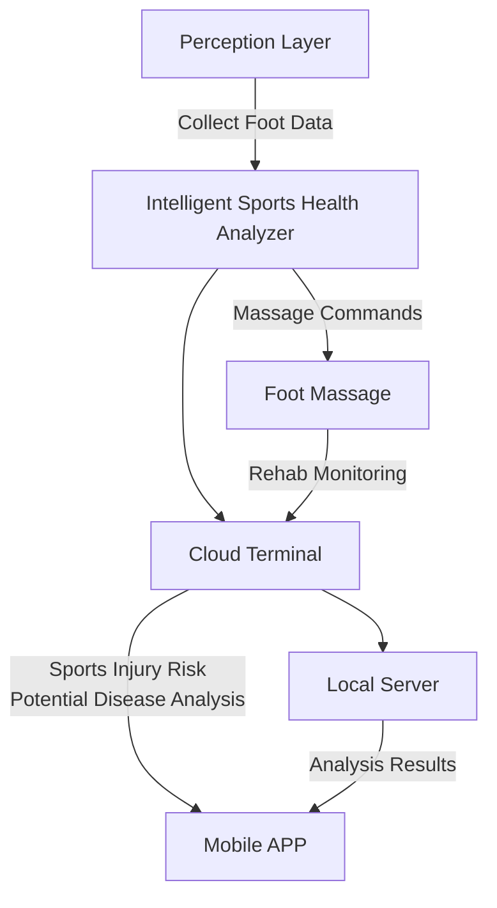
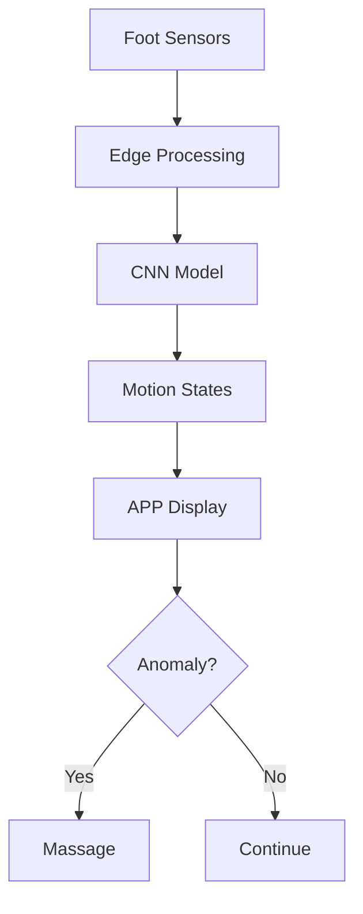

**Main Contributions**:
  
  *core member*
  
  1. overall data flow diagram

                                               Figure 17. overall data flow diagram

The sensor collects foot pressure and sports posture data, the micro-computer in the shoe recognizes walking, running, jumping and other states in real time, and synchronizes the data to the cloud to analyze the risk of sports injuries and diabetes and other diseases. The mobile APP displays real-time status, health reports, and can remotely start foot massage. The system dynamically adjusts the massage plan according to the cloud suggestions to form a closed-loop health management of "monitoring-analysis-intervention".

        2.Local acquisition and analysis process

In terms of acquisition equipment, we used four one-dimensional force sensors distributed on four acupoints, and in the local data analytics process, we used Wio Terminal, a high-performance embedded development board based on the SAMD51 microcontroller. Through our CNN model trained on the Internet (based on the TensorFlow Lite Micro machine learning library), the cloud-trained model can be run directly on the MCU, eliminating the need for a server, enabling analysis of the four motion states of the human body, namely running, jumping, stationary, and walking. Guaranteed real-time and reliability.

                                Figure 18.local algorithm architecture diagram
