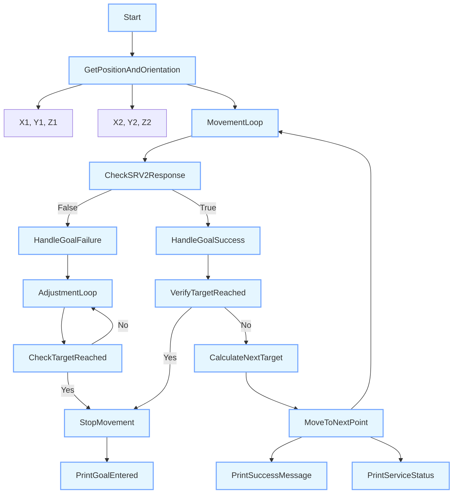

- **Main Contributions:**
  
  1. Robotic arm control
     
     
     
                         Figure 20.Schematic diagram of robot joint motion
     
     First of all, we carried out the forward and inverse kinematics solution of the robotic arm in matlab. We used the DH method for the forward motion solution, and the analytical solution for the inverse kinematics solution. After doing the above theoretical work in Matlab, we used the ROS package provided by JAKA to customize the control of the robotic arm to meet our needs for touch at different depths and speeds.

                                Figure 21.Flow chart of ROS control manipulator
